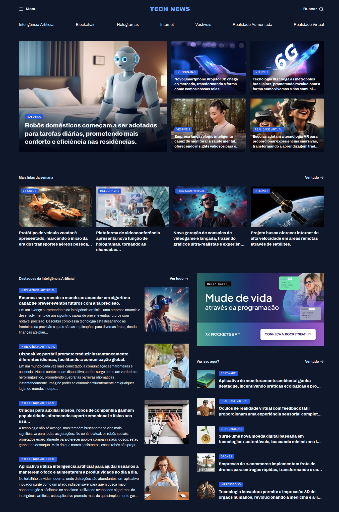

# Tech News: Portal de Notícias

> Formação Full-Stack: Avançando no HTML e CSS.

O projeto é uma página de notícias sobre tecnologia que apresenta tópicos como: IA, Robótica, VR Criptomoedas, Impressão 3D, entre outros.

[🔗 Clique aqui para acessar](https://fel1324.github.io/TechNews/)

## 🛠️ Tecnologias

- HTML
- CSS
- Git e Github

## 💚 Contato

rafael.roberto200618@gmail.com

---

Feito com ♥ by Rocketseat :wave: [Participe da nossa comunidade!](https://discord.gg/rocketseat)